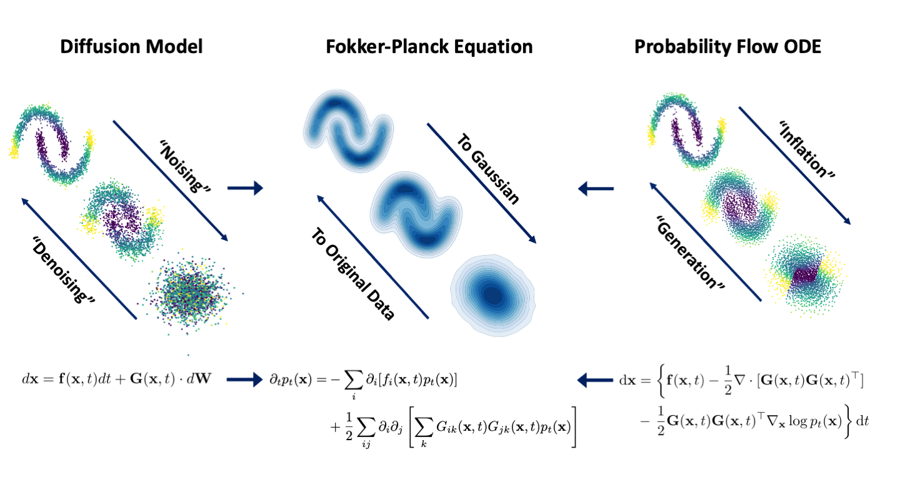

## Inflationary Flows: Calibrated Bayesian Inference with Diffusion-Based Models<br>



**Inflationary Flows: Calibrated Bayesian Inference with Diffusion-Based Models**<br>

Abstract: *Beyond estimating parameters of interest from data, one of the key goals of statistical inference is to properly quantify uncertainty in these estimates. In Bayesian inference, this uncertainty is provided by the posterior distribution, the computation of which typically involves an intractable high-dimensional integral. Among available approximation methods, sampling-based approaches come with strong theoretical guarantees but scale poorly to large problems, while variational approaches scale well but offer few theoretical guarantees. In particular, variational methods are known to produce overconfident estimates of posterior uncertainty and are typically non-identifiable, with many latent variable configurations generating equivalent predictions. Here, we address these challenges by showing how diffusion-based models (DBMs), which have recently produced state-of-the-art performance in generative modeling tasks, can be repurposed for performing calibrated, identifiable Bayesian inference. By exploiting a previously established connection between the stochastic and probability flow ordinary differential equations (pfODEs) underlying DBMs, we derive a class of models, \emph{inflationary flows,} that uniquely and deterministically map high-dimensional data to a lower-dimensional Gaussian distribution via ODE integration. This map is both invertible and neighborhood-preserving, with controllable numerical error, with the result that uncertainties in the data are correctly propagated to the latent space. We demonstrate how such maps can be learned via standard DBM training using a novel noise schedule and are effective at both preserving and reducing intrinsic data dimensionality. The result is a class of highly expressive generative models, uniquely defined on a low-dimensional latent space, that afford principled Bayesian inference.*

## Requirements

* Linux and Windows are supported, but we recommend Linux for performance and compatibility reasons.
* 1 high-end NVIDIA GPU. All testing and development done using NVIDIA RTX 3090 and 4090 GPUs. Code tested for single-GPU training and generation, though it can easily be adapted for multi-GPU setting.
* 64-bit Python 3.8 and PyTorch 2.1.2. See https://pytorch.org for PyTorch install instructions.
* Python libraries: See [environment.yml](./environment.yml) for exact library dependencies. You can use the following commands with Miniconda3 to create and activate your Python environment:
  - `conda env create -f environment.yml -n ifs`
  - `conda activate ifs`

## Data Preparation 

Datasets are stored in the same format as in [StyleGAN](https://github.com/NVlabs/stylegan3): uncompressed ZIP archives containing uncompressed PNG files and a metadata file `dataset.json` for labels. Custom datasets can be created from a folder containing images; see [`python dataset_tool.py --help`](./docs/dataset-tool-help.txt) for more information.

**CIFAR-10:** Download the [CIFAR-10 python version](https://www.cs.toronto.edu/~kriz/cifar.html) and convert to ZIP archive:

```.bash
python dataset_tool.py --source=downloads/cifar10/cifar-10-python.tar.gz \
    --dest=datasets/cifar10-32x32.zip
python fid.py ref --data=datasets/cifar10-32x32.zip --dest=fid-refs/cifar10-32x32.npz
```
**AFHQv2:** Download the updated [Animal Faces-HQ dataset](https://github.com/clovaai/stargan-v2/blob/master/README.md#animal-faces-hq-dataset-afhq) (`afhq-v2-dataset`) and convert to ZIP archive at 32x32 resolution:

```.bash
python dataset_tool.py --source=downloads/afhqv2 \
    --dest=datasets/afhqv2-32x32.zip --resolution=32x32
python fid.py ref --data=datasets/afhqv2-32x32.zip --dest=fid-refs/afhqv2-32x32.npz
```

## Training New Models 

**Toy DataSets** 

To train a model on a given toy dataset, run: 
```.bash
torchrun --rdzv_endpoint=0.0.0.0:29501 --outdir=out --data_name=circles \
--data_dim=2 --dims_to_keep=2 --tmax=7.01
```

Code supports following options for toy datasets: 

1) 2D circles (`circles`)
2) 2D sine (`sine2`)
3) 2D moons (`moons`)
4) 3D S Curve (`s_curve`)
5) 3D Swirl (`swirl`)

Note that `--data_dim` and `--dims_to_keep` arguments define schedule to be used - e.g., `data_dim==2` and `dims_to_keep==2` corresponds to PR-Preserving schedule for a 2D dataset. See **Table 2 on Appendix B.4.1** for details on training time (in Kimgs), `--tmax` argument choice, and specific `--data_dim` and `--dims_to_keep` combinations used for each toy experiment. 

Here,` s_curve` and `swirl` correspond to datasets scaled to unit variance across all dimensions. To use datasets scaled differently (as mentioned in **Appendix C.2.2**) pass instead `alt_s_curve` and `alt_swirl` in above command.

**Image Datasets** 

To train a model on a given image dataset: 

First, make sure you have downloaded and prepared the data using the `dataset_tool.py` script, as above. Then, run: 
```.bash
torchrun --rdzv_endpoint=0.0.0.0:29501 --outdir=out --data=datasets/cifar10-32x32.zip  \
--data_dim=3072 --dims_to_keep=3072 --rho=2 --batch=512  
```
Once again, `--data_dim` and `--dims_to_keep` define the specific schedule to be used. For instance, `data_dim==3072` and `dims_to_keep==3072` corresponds to PR-Preserving schedule for a 3x32x32 dataset. 

See **Tables 4, 5 of Appendix B.4.2** for additional details on training hyper-parameters used for the different image benchmark experiments. 


## Simulating PR-Preserving and PR-Reducing pfODEs

**Toy Datasets** 

To simulate our proposed pfODEs for toy datasets, run: 

```.bash
torchrun --rdzv_endpoint=0.0.0.0:29501 toy_pfODE_int.py net --save_dir=out \
--network=/networks/network.pkl --data_name=circles \
--data_dim=2 --dims_to_keep=2  
```

Simulation here entails inflation and roundtrip (from end of inflation), plus generation. 
All 3 simulations are saved separately to .npz files under `--save_dir`. Output files are named `{data_name}_{schedule}_net_{sim_type}_results.npz`, where `data_name` is the same as in argument passed, `schedule` corresponds to choice between `PRP` or `PRRto{x}D` (e.g., `PRRto1D`) and `sim_type` can be either `melt` (i.e., inflation), `rountrip`, or `gen`. 
Additionally, we also save a file named `{data_name}_{schedule}_net_sim_params.json`, which contains all parameters used in simulations. Options for `--data_name` are the same as mentioned above. 

Of note, network pickle file passed (`--network`) schedule needs to match `--data_dim` and `--dims_to_keep` given.

To run PR-Reducing (PRR) simulations, pass option `--eps=xx` using values listed in **Table 3 of Appendix B.4.1** for the different datasets. These correspond to latent space compressed dimension variances, used to construct diagonal covariance from which latent samples are obtained prior to running generation.

Finally, same script above also allows possibility of simulating our pfODEs using discrete scores (i.e., scores computed from batch of data directly, instead of using trained networks). These are meant as approximations only and can be used for sanity checking. To run such simulations, use instead: 

```.bash
torchrun --rdzv_endpoint=0.0.0.0:29501 toy_pfODE_int.py discrete --save_dir=out \
--data_name=circles --data_dim=2 --dims_to_keep=2  
```

As with  net case, `--data_dim` and `--dims_to_keep` determnine actual schedules simulated. If running PR-Reducing simulations, pass argument `--eps=xx` using values shown in **Table 3 of Appendix B.4.1**.

**Image Datasets** 

To simulate our proposed pfODEs for a batch of samples from an image dataset, run: 

```.bash
torchrun --rdzv_endpoint=0.0.0.0:29501 pfODE_int.py --save_dir=out \
--data_root=datasets/cifar10-32x32.zip --network=networks/network.pkl \
--data_name=cifar10 --bs=256 --dims_to_keep=3072
```
By default, this will run inflation, roundtrip (from inflation), and generation for a batch of data of specified  size (i.e., `--bs`). However, one can also run these simulations separately by passing instead `--sim_type={sim_name}` where `sim_name` can be either `melt` (i.e., inflation), `roundtrip`, or `gen`. If running roundtrip, script expects a previous inflation to start from - this should be passed using `--prev_melt=/exps/cifar10_PRP_melt.npz`. 

As in toy case, simulations are saved to separate .npz files and all parameters used are logged to `{data_name}_{schedule}_HD_pfODE_int_sim_params.json`.

To run PR-Reducing simulations pass `--eps==xx`, using values shown in **Table 7 Of Appendix B.5**. These values represent latent space variance for compressed dimensions and are used to construct diagonal covariance from which we obtain initial Gaussian samples for generation.


## Computing FID scores 

To compute FID scores for image datasets, run: 

```.bash
torchrun --rdzv_endpoint=0.0.0.0:29501 gen_fid_samples --save_dir=fid-tmp --network=networks/network.pkl \
--bs=500 --seeds=0-49999 --subdirs --dims_to_keep=3072 

torchrun --rdzv_endpoint=0.0.0.0:29501 fid.py calc --images=fid-tmp \
--ref=fid-refs/cifar10-32x32.npz
```

The first command will generate several samples (same as number of seeds specified using `--seeds`) and will save these to a specified directory, with every 1000 new images saved under a separate subdirectory.
Note that schedule network was trained on needs to match `--dims_to_keep` option given (e.g., PRP network needs `dims_to_keep=3072` for 3x32x32 data). 
If running generation for PR-Reducing schedules, adjust `--dims_to_keep` and `--network` options appropriately, and pass `--eps=xx` using values listed on **Table 7 of Appendix B.5**. 

Second command computes actual fid score for the previously generated images and uses reference file created during dataset preparation (see above).

## Computing Roundtrip MSE 

To compute roundtrip MSE for image datasets, run: 

```.bash
torchrun --rdzv_endpoint=0.0.0.0:29501 calc_roundtrip_mse.py --save_dir=mse-tmp --data_root=datasets/cifar10-32x32.zip \
--network=networks/network.pkl --data_name=cifar10 --bs=1000 --total_samples=10000 --seed=42 --dims_to_keep=3072
```

Here, once again, schedule for `--network` and `--dims_to_keep` optios need to match. Total number of samples used for roundtrip experiment can be changed using `--total_samples` and `--bs` determines batch size to use when simulating rountrips. Finally, `--seed` determines seed to use when sampling from given target dataset at the beginning of melt/inflation.
Script outputs a .json file containing all simulation parameters along with mse result (averaged across all samples and dimensions).

## Running Toy 2D alpha-shape or 3D mesh experiments

To run alpha-shape or mesh toy coverage experiments, run: 

```.bash
torchrun --rdzv_endpoint=0.0.0.0:29501 --network=networks/network.pkl --save_dir=toy_mesh_exps-tmp \
--data_name=circles --data_dim=2 --dims_to_keep=2 --steps=701 --h=1e-2
```

Here, options for `--network`, `--data_dim`, and `--dims_to_keep` need to match for a given schedule (e.g., PRP trained net for 2D circles, needs `data_dim==2` and `dims_to_keep==2`). 
Same toy dataset options are supported here (see above) - specific toy data to use should be specified using `--data_name` option. This needs to match data network was trained on.

Finally, `--steps` determines the number of linearly spaced ODE integration steps taken. This value can obtained using the `tmax` values highlighted in **Table 2 of Appendix B.4.1** (e.g., for a step size of $10^{-2}$ (`--h=1e-2`), 
and `tmax=7.01`, we should use `--steps=701`). Script uses 20K test points and 200 boundary points per bounding sphere as defaults. 

## Computing Network Residual Cross-Correlations

**Toy Networks**

Run: 

```.bash
torchrun --rdzv_endpoint=0.0.0.0:29501 calc_net_residuals_autocorrelations.py extracttoys --save_dir=toy_net_outputs-tmp \
--data_name=circles --network=networks/network.pkl --n_time_pts=701 --h=1e-2 --n_samples=10000 \
--data_dim=2 --dims_to_keep=2

python calc_net_residuals_autocorrelations.py calctoys --save_dir=toy_net_acs-tmp \
--res_root=toy_net_outputs-tmp/circles_PRP_toy_net_outputs_residuals.npz --data_name=circles \
--n_time_pts=701 --data_dim=2 --dims_to_keep=2 --n_samples=10000
```
First command extracts network outputs and residuals for a given number of time pts and step size (same as used in ODE integration/discretization schedule). 
Once again, options for `--network`, `--data_dim`, and `--dims_to_keep` need to match for a given schedule (e.g., PRP trained net for 2D circles, needs `data_dim==2` and `dims_to_keep==2`). 

Same toy dataset options are supported here (see above) - toy data to use should be specified using `--data_name` option. This needs to match data network was trained on.

Extracted network outputs and residuals are saved to a file named `{data_name}_{schedule}_toy_net_outputs_residuals.npz`, under specified `--save_dir` option.

Second command loads .npz file output from first command and uses its values to calculate cross-correlations for the different time points/lags passed. Options passed for `--data_name`, 
`--data_dim`, `--dims_to_keep`, `--n_time_pts`, and `--n_samples` should match values passed to first command. 

Computed cross-correlation matrices for network outputs and residuals are saved to a file named `{data_name}_{schedule}_toy_autocorrelations.npz`. 
Plots shown in Appendix C.1 were obtained by looking into network residual cross-correlations (under `net_residuals_acs` key of output file).

**Image Networks**

Run: 

```.bash
torchrun --rdzv_endpoint=0.0.0.0:29501 calc_net_residuals_autocorrelations.py extract --save_dir=net_outputs-tmp \
--data_root=datasets/cifar10-32x32.zip --network=networks/network.pkl --data_name=cifar10 \
--n_samples=50000 --bs=1000 --dims_to_keep=3072 --n_time_pts=256

torchrun --rdzv_endpoint=0.0.0.0:29501 calc_net_residuals_autocorrelations.py calc --save_dir=net_acs-tmp \
--res_root=net_outputs-tmp --data_name=cifar10 --n_time_pts=256 --dims_to_keep=3072 \
--n_samples=50000 --bs=500
```
As before, `--dims_to_keep` needs to match schedule for `--network` option passed. First command will extract network outputs and residuals for given number of samples `--n_samples` 
and across specified number of time pts and will save these as .npz files named `{data_name}_{schedule}_net_outputs_residuals_time{t}.npz`, one per each time point/lag. 

Second command will load the files output by first command and will use these to calculate cross-correlations across different time pts/lags. Computed cross-correlatices of network outputs
and residuals are saved to files named `{data-name}_{schedule}_autocorrelations_times0_{t}.npz`  for each time pt t. 
Plots shown in Appendix C.1 were obtained by looking into network residual cross-correlations (under `net_residuals_acs` key of output files).

## Acknowledgments
This implementation relies heavily on the follwoing pre-existing repository:[https://github.com/NVlabs/edm](https://github.com/NVlabs/edm). We use similar data preprocessing, augmentation, architectures, and training to the above, safe for modifications needed to implement our proposed model and probability flow ODEs (pfODEs).


## License


